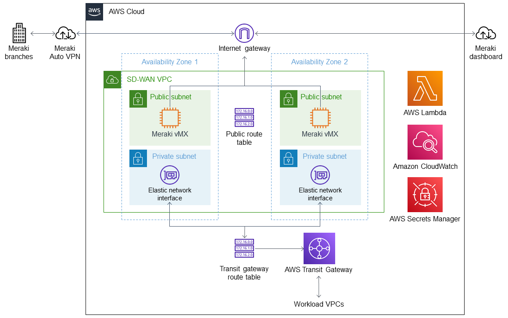

:xrefstyle: short

Deploying this Quick Start for a new virtual private cloud (VPC) with
default parameters builds the following {partner-product-short-name} environment in the
AWS Cloud.

// Replace this example diagram with your own. Follow our wiki guidelines: https://w.amazon.com/bin/view/AWS_Quick_Starts/Process_for_PSAs/#HPrepareyourarchitecturediagram. Upload your source PowerPoint file to the GitHub {deployment name}/docs/images/ directory in this repo. 

[#architecture1]
.Quick Start architecture for {partner-product-short-name} on AWS

As shown in <<architecture1>>, the Quick Start sets up the following:

* A highly available architecture that spans two Availability Zones.*
* A VPC configured with public subnets, according to AWS best practices, to provide you with your own virtual network on AWS.*
* An internet gateway that connects the VPC to the internet.
* A VPC route table associated with the public subnets to specify routing rules for outbound internet traffic.
* In the public subnets, Meraki vMX appliances on Amazon Elastic Compute Cloud (Amazon EC2) instances.
* AWS Transit Gateway attached to the VPC, enabling connectivity to attached workload VPCs in other AWS Regions.
* A transit gateway route table associated with the VPC for routing rules to AWS Transit Gateway.
* Amazon CloudWatch to collect logs of vMX instance performance.
* AWS Lambda to monitor the state of the vMX instances. If an instance fails, AWS Lambda updates route tables to point to a healthy instance and logs the event in CloudWatch.
* AWS Secrets Manager to store a Meraki API key. AWS Lambda uses the API key to access the Meraki dashboard when updating route tables.

[.small]#*The template that deploys the Quick Start into an existing VPC skips the components marked by asterisks and prompts you for your existing VPC configuration.#