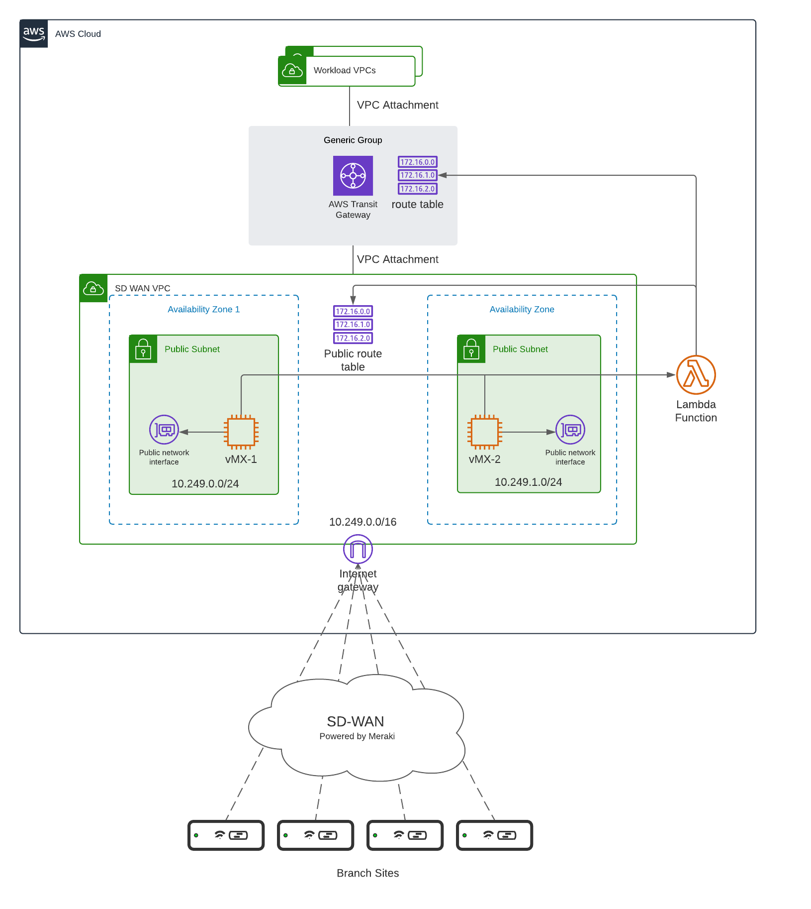

:xrefstyle: short

Deploying this Quick Start for a new virtual private cloud (VPC) with
default parameters builds the following {partner-product-short-name} environment in the
AWS Cloud.

// Replace this example diagram with your own. Follow our wiki guidelines: https://w.amazon.com/bin/view/AWS_Quick_Starts/Process_for_PSAs/#HPrepareyourarchitecturediagram. Upload your source PowerPoint file to the GitHub {deployment name}/docs/images/ directory in this repo. 

[#architecture1]
.Quick Start architecture for {partner-product-short-name} on AWS

As shown in <<architecture1>>, the Quick Start sets up the following:

* A highly available architecture that spans across two Availability Zones.
* A SDWAN VPC is deployed and configured with public internet access, according to AWS
best practices, to provide you with your own virtual network on AWS.
* An internet gateway for public internet access. 
* An AWS Secret Manager secret to store the Meraki API Key.
* Two vMX Appliances. The vMXs are deployed as hubs and onboarded to their corresponding Meraki networks based on the authentication token entered during deployment.
* In the SDWAN VPC, a public route table is deployed.
* In the public subnets:
** vMX instances with an internet routable IP are deployed.
* A periodic Cloudwatch event that is scheduled at fixed time intervals of 1, 10 or 60 mins
* In addition a Transit Gateway is deployed to extend connectivity for the Meraki SDWAN fabric to workload resources across different regions.
** The SDWAN VPC is attached as a VPC attachment to the Transit Gateway.
* A lambda function is deployed to monitor the state of the vMXs and update the VPC and the TGW route tables to handle failover and failback.
** The lambda fetches the auto-vpn routes destined for the vMX hubs from the Meraki Dashboard and updates the SDWAN VPC route table and the TGW route tables.
** Monitors the state of the vMX instances and incase of a failure moves all the appropriate routes to the active vMX.
** The lambda uses the Meraki API key stored in AWS Secret manager to connect to the Meraki Dashboard and is triggered based on the Cloudwatch events defined above.