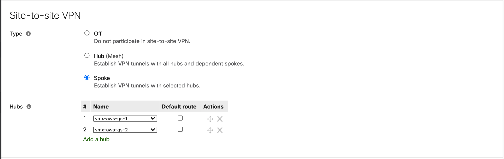

=== Confirm your AWS account configuration

. Sign in to your AWS account at https://aws.amazon.com with an IAM user role that has the necessary permissions. For details, see link:#_planning_the_deployment[Planning the deployment] earlier in this guide.
. Make sure that your AWS account is configured correctly, as discussed in the link:#_technical_requirements[Technical requirements] section.

// Optional based on Marketplace listing. Not to be edited
ifdef::marketplace_subscription[]
=== Subscribe to the {partner-product-short-name} AMI

This Quick Start requires a subscription to the AMI for {partner-product-short-name} in AWS Marketplace.

. Sign in to your AWS account.
. Open the page for the {marketplace_listing_url}[{partner-product-short-name} AMI in AWS Marketplace^], and then choose *Continue to Subscribe*.
. Review the terms and conditions for software usage, and then choose *Accept Terms*. +
  A confirmation page loads, and an email confirmation is sent to the account owner. For detailed subscription instructions, see the https://aws.amazon.com/marketplace/help/200799470[AWS Marketplace documentation^].

. When the subscription process is complete, exit out of AWS Marketplace without further action. *Do not* provision the software from AWS Marketplace—the Quick Start deploys the AMI for you.
endif::marketplace_subscription[]
// \Not to be edited

=== Meraki Dashboard Configuration

. Deploy the vMX Nodes: First we need to generate two vMX nodes inside the Meraki dashboard which we will then instantiate on AWS.  Begin by creating two new Security Appliance network in your organization. This https://documentation.meraki.com/General_Administration/Organizations_and_Networks/Creating_and_Deleting_Dashboard_Networks[guide^] will walk you through creating a new network in the Meraki Dashboard.
Once you have created the network and added the appropriate license you will be able to deploy a new vMX instance in your network by navigating to Security & SD-WAN > Appliance Status and clicking on the relevant 'Add VMX' button:on your Meraki dashboard.
+
image::../images/vmx_license.png[vMX License]
+
For more details, please refer to the *Meraki Dashboard Configuration* section of the https://documentation.meraki.com/MX/MX_Installation_Guides/vMX_Setup_Guide_for_Amazon_Web_Services_(AWS)#Meraki%20Dashboard%20Configuration[vMX Setup Guide for AWS^]

. Deploy Network Tags: For identifying the appropriate vMXs as primary and seconday hubs, we leverage Network Tags. vMX-1 is is used to identify the primary hub and vMX-2 tag is used to identify the secondary Hub. To set the network tags for the vMXs, navigate to the *Organization > Overview* page and select the checkbox next to the network that you wish to tag. Below is a snippet of the Meraki Dashboard Overview page:
+
image::../images/vmx_tags.png[vMX Tags]
+
For more information about Network Tags, please refer to the https://documentation.meraki.com/General_Administration/Organizations_and_Networks/Organization_Menu/Manage_Tags[Manage Tags Guide^]

. Branch Site Configuration: Navigate to Security & SD-WAN > Configure > Site-to-Site page on the Meraki Dashboard and configure your branch sites as autovpn spokes with the vMXs as the primary and secondary hubs.
+

+
For more information, please refer to the https://documentation.meraki.com/MX/Site-to-site_VPN/Meraki_Auto_VPN_-_Configuration_and_Troubleshooting[Meraki Auto VPN - Configuration and Troubleshooting Guide^]

. Generate Authentication Tokens for the vMXs: After you've added the new vMX to your network, navigate to *Security & SD-WAN > Appliance* status and select “*Generate authentication token”* to generate the token. This token would be used as an input parameter for the Quickstart templates.
+
image::../images/vmx_auth_token.png[vMX Auth Token]
image::../images/vmx_auth_token_2.png[vMX Auth Token-2]

=== Launch the Quick Start
Each deployment takes about {deployment_time} to complete.

. Sign in to your AWS account, and choose one of the following options to launch the AWS CloudFormation template. For help with choosing an option, see link:#_deployment_options[Deployment options] earlier in this guide.
+
[cols="3,1"]
|===
^|http://qs_launch_permalink[Deploy {partner-product-short-name} into a SDWAN VPC on AWS^]
^|http://qs_template_permalink[View template^]

|===
+
. Check the AWS Region that’s displayed in the upper-right corner of the navigation bar, and change it if necessary. This Region is where you build the network infrastructure. The template is launched in the {default_deployment_region} Region by default. For other choices, see link:#_supported_regions[Supported Regions] earlier in this guide.
. On the *Create stack* page, keep the default setting for the template URL, and then choose *Next*.
. On the *Specify stack details* page, change the stack name if needed. Review the parameters for the template. Provide values for the parameters that require input. For all other parameters, review the default settings and customize them as necessary. For details on each parameter, see the link:#_parameter_reference[Parameter reference] section of this guide. When you finish reviewing and customizing the parameters, choose *Next*.
